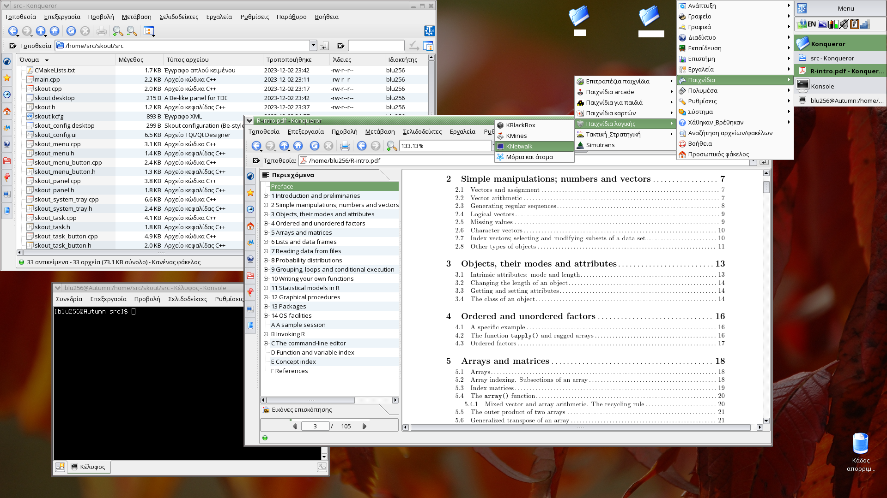

Skout
-----

Skout is a panel for TDE in the spirit of Tracker, the desktop panel of BeOS and now Haiku.

It is currently in development, so not all features might be implemented.

Features:
* Desktop menu
* System tray
* Grouping taskbar
* 2 positions on desktop (top left and top right)
* TDE Control Centre module
