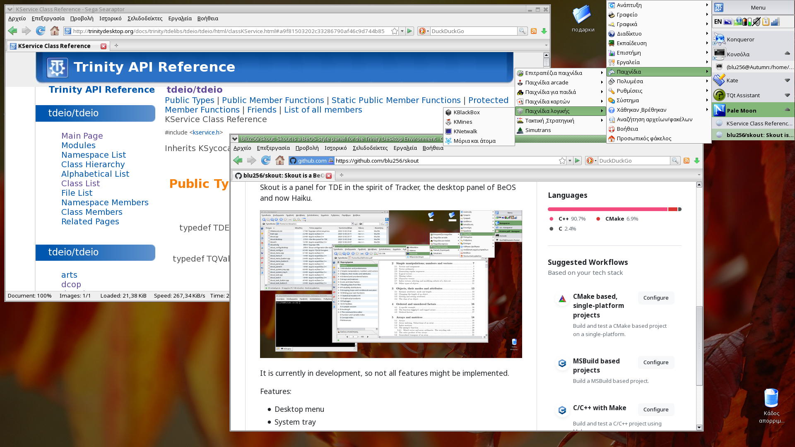

Skout
-----

Skout is a panel for TDE in the spirit of Deskbar, the desktop panel of BeOS and now Haiku.

Despite undergoing heavy development and being subject to changes, Skout is stable
enough to be daily-driven.

Features:
* Look and feel close to BeOS/Haiku deskbar
* 2 positions on desktop (top left and top right)
* Powerful task list applet with window, operations, pinnable applications, ...
* Integration with ksystraycmd to place any application windows in system tray
* Close integration with Trinity Desktop Environment
* TDE Control Centre module

Applets included by default:
* System tray
* Calendar
* Task manager

Experimental features (not built by default, include bugs):
* Kicker applet support
* Pager applet (just use KPager for now)